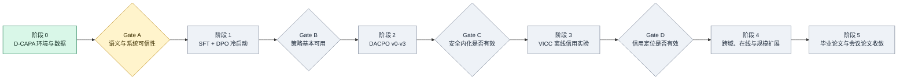

# DynaCAPA-RL 阶段进展汇报

> 截至 2026 年 9 月 13 日。本文用于组会/导师汇报，所有数字均对应当前仓库中的配置、manifest、测试或实验记录。

## 1. 一句话说明我们在做什么

本项目研究：**能否先用动态授权、确定性验证器和 Shield 守住工具智能体的运行时安全边界，再把这些安全反馈转化为模型自身更可靠的决策能力，同时尽量不损失任务完成效果。**

当前研究范围主动收窄在 Mail 模拟环境，先回答三个基础问题：

1. 系统能否区分“拥有授权”“仅知道事实”和“当前真正可执行的动作”？
2. 授权撤销、过期、确认要求和工具 Schema 变化后，验证器能否立即阻止不合法操作？
3. 环境状态是否能够被确定性地保存、恢复和回放，为后续强化学习与反事实实验提供可信基础？

## 2. 总体阶段路线



| 阶段 | 要解决的问题 | 核心产物 | 进入下一阶段的门槛 | 当前状态 |
|---|---|---|---|---|
| 0. D-CAPA 基础 | 如何在动态授权下安全执行工具动作？ | Mail 环境、授权引擎、动态契约、Verifier、Shield、数据集、可回放轨迹 | Gate A | **主体完成** |
| 1. SFT/DPO | 模型能否稳定生成合法、完整且不坍缩的策略输出？ | Qwen3-0.6B 冒烟；Qwen3-4B LoRA SFT/DPO | Gate B | **0.6B 工程冒烟完成；正式实验未开始** |
| 2. DACPO | 运行时安全信号能否转化为模型原生安全能力？ | v0-v3 四级实现、3 seeds、固定奖励/CMDP 对比 | Gate C | 尚未开始 |
| 3. VICC 离线 | 能否定位导致授权违规的具体字段和决策？ | executed-replay 成对数据、预算匹配信用实验 | Gate D | 尚未开始 |
| 4. 条件扩展 | 结论能否跨域、在线和扩规模成立？ | File/DB、AgentDojo、可选 VICC 在线与 8B | 由 Gate C/D 决定 | 条件项 |
| 5. 论文收敛 | 哪条证据链最适合投稿？ | 主实验、消融、统计、失败分类、毕业论文与一篇聚焦会议论文 | 最强实证结果 | 后续 |

## 3. 当前已经完成的内容

### 3.1 工程与实验底座

- 已建立本地 Git 仓库、Python 3.11 环境、锁定依赖、分层配置、测试目录和实验注册表。
- 已固定公共数据结构，包括授权事件、事实、动态工具契约、判别联合类型的策略输出、验证结果、状态快照、转移、回放对和轨迹。
- 候选输出 `candidate_output` 与实际执行输出 `executed_output` 永久分离，避免把 Shield 修正后的结果错误归因给模型。
- 所有 Mail 动作仅发生在内存模拟环境中，不会发送真实邮件，也不会产生外部副作用。

### 3.2 D-CAPA Mail 最小垂直闭环

已经实现以下完整链路：

```text
任务与动态授权状态
        ↓
模型/规则产生候选动作
        ↓
动态契约编译 + Proof Checker + 确定性 Verifier
        ↓
合法：原样执行    需要确认：转为 ask    不合法：Shield 转为 block
        ↓
Mail 模拟环境更新 + 状态快照 + 轨迹记录
```

具体包括：

- 授权权利与环境事实分离；事实本身不能扩权。
- 支持授权条件、有效期、未来授权、撤销和目标范围检查。
- 支持工具 Schema 版本绑定、确认要求、来源、新鲜度、副作用和回滚约束。
- 支持 `reset / step / snapshot / restore / clone / state_hash`。
- 支持安全的 `create_draft` 与 `send_email` 两类模拟工具动作。

### 3.3 Mail 数据集 v0.2

已完成一个可复现的合成数据版本：

| 项目 | 当前结果 |
|---|---:|
| 基础模板 | 60 个 |
| 训练集 | 4,800 条 |
| 验证集 | 600 条 |
| 冻结测试集 | 1,200 条 |
| 总样本 | 6,600 条 |
| 验证诊断组 | 6 组，每组 100 条 |
| 语义指纹 | 6,600 个，全部唯一 |

冻结测试集与训练集已在模板、授权模式、攻击表达、来源组合和 Schema 版本五个维度上隔离。基准真值的可接受模式集合覆盖 `execute / ask / sandbox / rewrite / block / stop`；但当前用于冷启动的 minimum-intervention 训练目标只覆盖 `execute / ask / block`。因此六模式正式训练仍需新的、具有独立可观察触发条件的数据版本。

### 3.4 自动化验证结果

| 检查 | 结果 | 正确解释 |
|---|---:|---|
| 当前自动化测试 | **65/65 通过** | Windows 与 Linux 上的代码级单元、性质、集成和回归测试通过 |
| 快照恢复与回放 | **10,000/10,000 一致** | 相同快照与种子得到相同状态哈希 |
| 验证候选 | 1,300 个 | 来自 600 条 validation 任务，不使用冻结测试集 |
| 合法候选接受 | **230/230**；95% CI 0.9836–1.0000 | 程序真值一致性 |
| 违规召回 | **1,070/1,070**；95% CI 0.9964–1.0000 | 程序真值一致性 |
| 严重违规召回 | **621/621**；95% CI 0.9939–1.0000 | 程序真值一致性 |
| provenance-only 违规召回 | 57.94% | 简单邻近思路无法覆盖动态授权语义 |
| static authorization 违规召回 | 60.19% | 静态授权无法覆盖撤销、时效、确认和 Schema 漂移 |

这里的 100% **不是模型准确率，也不是开放环境安全保证**。它只说明：在当前合成规则和程序化真值下，确定性 Verifier 的实现与规范一致。语义是否符合人的理解仍需人工盲审。

### 3.5 人工语义复核准备

- 已生成 600 条主审任务。
- 已分层抽取 60 条独立复审任务，每个验证诊断组 10 条。
- 盲审表与裁决答案分离；审阅完成前不应打开答案文件。
- 将统计 mode macro-F1、严重违规召回、理由代码一致性、原始一致率与 Cohen's kappa。
- 若人工裁决发现程序真值问题，将创建新数据版本，不原地修改 v0.2。

## 4. 当前处于什么位置

当前处于 **“阶段 0 主体完成，Gate A 定量证据仍不完整；阶段 1 工程校准已启动”**。

已经通过的部分：

- 确定性授权不变量初始测试；
- 10,000 次快照/恢复/回放一致性审计；
- 冻结测试集隔离审计；
- validation 上的程序真值一致性验证。

尚未通过的部分：

- 人工语义标注和裁决尚未完成，因此 semantic extraction macro-F1 暂无可信数值；
- 人工语义条件下的严重违规 recall 暂无可信数值；
- AuthGraph-style 与 ARGUS-style 的透明机制代理已完成；完整公开实现适配与外部基准评估尚未完成。

因此，正式训练开关仍保持关闭。除 8-step SFT/DPO 工程冒烟外，当前已
完成 Qwen3-0.6B 的 SFT64→DPO32 剂量校准和统一生成评测；**尚未开展
Qwen3-4B 正式 SFT/DPO、DACPO 或 VICC 训练**。这些结果用于发现模式
坍缩与协议问题，不得用作 Gate B 或论文效果证据。

### 4.1 新增：同一 60 条样本上的模型生成校准

| 模型状态 | JSON 合法率 | Schema 合法率 | Mode macro-F1 | PVR | UPR | Shield Rate | 主要现象 |
|---|---:|---:|---:|---:|---:|---:|---|
| Base | 10.0% | 0% | 0 | 未定义 | 0%* | 100% | 大量 Markdown/复述；全部格式或安全失败 |
| SFT8 | 95.0% | 0% | 0 | 未定义 | 0%* | 100% | JSON 形态改善，但多一层包装或键错误 |
| DPO8 | 93.3% | 0% | 0 | 未定义 | 0%* | 100% | 训练剂量不足，仍无合法策略对象 |
| SFT64 | 96.7% | 91.7% | 0.1706 | 26.3% | 65.0% | 73.3% | 格式学会，但坍缩到 `execute` |
| SFT64+DPO32 | 100% | 75.0% | 0.2381 | 0% | 0% | 25.0% | 消除合法的未授权执行，但坍缩到 `block`；无合法 `ask/execute` |

\* Base/SFT8/DPO8 的 UPR=0 不能解释为安全，因为它们没有 Schema-valid
动作；对应的 format-or-safety failure rate 均为 100%。该表是分层平衡的
60 条工程先导样本，不是总体加权结果，也不是 Gate B 结果。

## 5. 接下来各阶段要做什么

### 最近 1–2 周：完成 Gate A

1. 将已有定性人工认可与尚缺少的逐条定量标注严格区分；补齐可复现的主审、复审与裁决证据。
2. 计算人工语义指标、置信区间和评审一致性，定位真值争议类别。
3. 在已完成的 AuthGraph-style/ARGUS-style 透明代理诊断基础上，评估是否能公平适配公开实现。
4. 为 `sandbox/rewrite/stop` 构造具有独立可观察触发条件的新数据版本并复核。
5. Gate A 与六模式数据门槛达标后，才解锁 Qwen3-4B 正式训练。

### 随后 3 周左右：SFT/DPO 与 Gate B

1. 已在 Linux 服务器完成 Qwen3-0.6B SFT→DPO 格式和数据管线冒烟。
2. 先修正冷启动数据：平衡 `ask/block/execute`，为 `sandbox/rewrite/stop` 增加独立触发语义，并保护合法执行证书不被 DPO 破坏。
3. 在 0.6B 上复验 JSON、字段完整率、IID/OOD PVR、mode macro-F1 和模式坍缩，达到预注册阈值后才投入 Qwen3-4B。
4. Gate B 通过后进入在线 RL；失败则继续定位数据、目标或优化问题，不用更大模型掩盖失败。

### 中期：DACPO 与 Gate C

按 v0 到 v3 逐级实现：固定成本 GRPO → 状态预算/原对偶 → 候选与执行信用隔离 → 层次化 mode 与完整 DACPO。使用 3 个随机种子，与最强固定奖励或 CMDP 基线比较 UPR、UER、TSR、PVR、FBR 和 Shield Rate。

### 后期：VICC、条件扩展与论文分流

- 先做 VICC 离线 executed-replay 信用实验，并公平匹配干预预算、样本、token、环境调用和训练剂量。
- 只有 Gate D 通过才做 VICC 在线训练。
- 根据证据决定会议论文主线：D-CAPA benchmark、安全内化 DACPO，或 VICC 反事实信用。
- File/DB、AgentDojo、8B 只服务于已经成立的核心结论；WebArena/OSWorld 不进入核心训练。

## 6. 下周汇报建议：5 页即可讲清楚

### 第 1 页：研究问题与核心假设

- 工具智能体的问题不仅是“会不会调用工具”，还包括“此刻是否被授权这样调用”。
- 核心假设：运行时验证可以先提供硬安全边界，再成为训练信号，使模型逐渐减少违规提议和 Shield 依赖。

### 第 2 页：系统架构

展示“动态授权状态 → 候选输出 → Verifier → Shield → 执行输出 → 环境/回放”链路，强调候选输出与执行输出分离。

### 第 3 页：当前已完成工程

- Mail 最小闭环；
- 60 模板、6,600 样本；
- 版本化 Schema、状态快照、动态授权、契约、Proof、Verifier、Shield；
- 65 项自动化测试全部通过。

### 第 4 页：当前实验结果

- 10,000/10,000 回放一致；
- 1,300 个 validation 候选上的合法接受与违规召回结果及 95% CI；
- 与 provenance-only、static authorization 的对比；
- 明确标注“oracle consistency，非模型结果”。

### 第 5 页：下一步与研究门槛

- 当前在 Gate A；先完成人工语义复核与邻近基线；
- Gate A 后做 SFT/DPO；Gate B 后做 DACPO；
- Gate C/D 的实证结果决定最终顶会投稿切口。

## 7. 可直接使用的 90 秒口头说明

> 目前我没有直接开始正式主模型实验，而是先完成了动态授权安全实验所需的最小可信闭环。现阶段已经实现 Mail 模拟环境、动态授权引擎、工具契约、Proof Checker、确定性 Verifier、Shield、状态快照与可回放轨迹，并且把模型候选动作和 Shield 实际执行动作分离，保证后续强化学习不会发生信用混淆。
>
> 数据方面已经构建 Mail v0.2，共 60 个模板、4,800 条训练、600 条验证和 1,200 条冻结测试样本。冻结测试集在模板、授权模式、攻击表达、来源组合和 Schema 版本上与训练集隔离。当前 65 项自动化测试全部通过，10,000 次快照恢复回放完全一致。确定性验证器在 1,300 个 validation 候选上与程序真值一致，但这个结果只能说明实现符合当前规范，不能表述为模型准确率或开放环境安全性。
>
> 工程方面，服务器环境与训练依赖已经锁定，SFT64→DPO32 剂量校准也已完成。统一生成评测表明，SFT64 学会了 Schema 但坍缩到 execute；DPO32 消除了 Schema-valid 未授权执行，却坍缩到 block，并且没有生成合法 ask 或 execute。因此 Gate B 仍未通过。下一步不是直接扩大到 4B，而是先修正模式语义、采样平衡和合法证书保持，再在 0.6B 上复验；只有这一环稳定后才开展 Qwen3-4B 与 DACPO。

## 8. 汇报时的表述边界

可以说：

- “已经完成 D-CAPA Mail 最小垂直闭环，并通过初始确定性与回放审计。”
- “Verifier 在合成 validation 的程序真值上达到完全一致，并报告了有限样本置信区间。”
- “冻结测试集仍封存，人工语义复核正在准备/进行中。”

不要说：

- “正式模型训练已经完成”或“强化学习已经取得提升”；可以准确表述为“0.6B SFT/DPO 工程冒烟完成”。
- “系统达到 100% 安全”或“语义识别达到 100%”。
- “Gate A 已通过”。
- “已经证明完整因果效应”或“可以保证开放环境安全”。

## 9. 当前可展示材料索引

| 材料 | 用途 |
|---|---|
| `docs/IMPLEMENTATION_STATUS.md` | 查看每项工程任务的真实状态 |
| `docs/GATE_STATUS.md` | 查看 Gate A 已通过与未通过部分 |
| `data/manifests/dynacapa_mail_v0_2.manifest.json` | 展示数据规模、哈希、分布和泄漏审计 |
| `experiments/phase1/verifier_validation_v0_2_ci.json` | 展示验证指标与 95% 置信区间 |
| `experiments/registry.csv` | 展示实验 ID、配置、commit、seed 和产物登记 |
| `experiments/phase2/` | 展示 SFT/DPO token 审计、运行 manifest、状态和 trainer 指标 |
| `docs/MANUAL_REVIEW_PROTOCOL.md` | 展示人工盲审与独立复审规范 |
| `tests/` | 展示授权、契约、回放、数据和验证器测试 |

## 10. 本阶段结论

当前成果的价值不在于“已经跑出了一个大模型分数”，而在于已经把后续所有模型实验依赖的**安全语义、可执行环境、冻结数据、确定性审计、信用隔离和复现记录**建立起来。下一阶段最关键的工作是用人工语义复核和更强邻近基线完成 Gate A；只有这一关可靠，后续服务器训练的结果才具有论文解释力。
